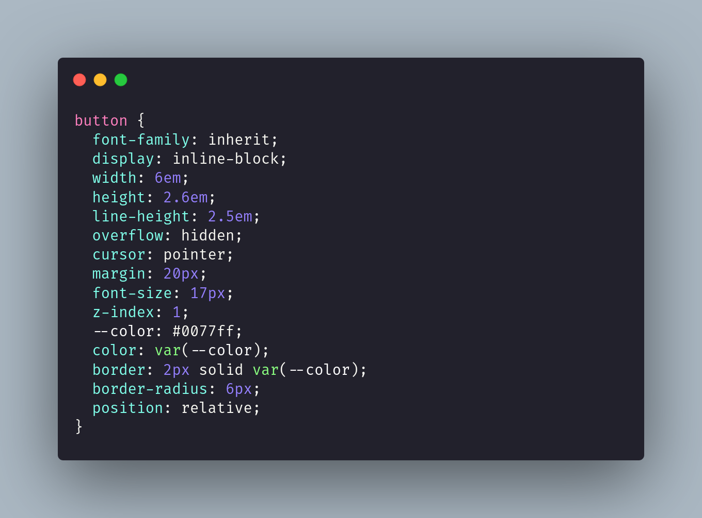
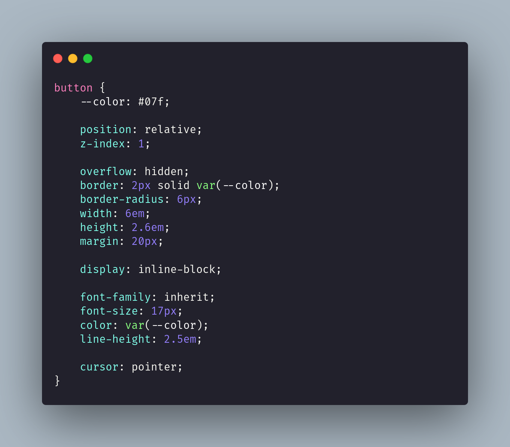

# 📦 Stylelint config by @duduardeagle

<a target="_blank" href="https://www.npmjs.com/package/@duduardeagle/stylelint-config">
    
</a>

> An opinionated Stylelint configuration

## 🚀 Getting started

This is my personal config for [Stylelint](https://stylelint.io), according to my own experience 🤓.

Tell me 💬 what do you think about it?, will you use it?, why? I look forward to hearing your comments here and on my social media.

### ✨ Features

- Helps to keep CSS code clean with most rules with an error severity
- Customized order for CSS properties, separated by groups
- Autofixing support
- Can be perfectly used with [BEM](https://getbem.com/) methodology
- Supported integrations:
  - [TailwindCSS](https://tailwindcss.com)
  - [postcss-mixins](https://www.npmjs.com/package/postcss-mixins)

### 📝 Order rules

✳️ In general, the order of content within declaration blocks should be organized as follows:

- dollar variables (e.g., `$color: red;`)
- custom properties (e.g., `--color: red;`)
- @add-mixin at-rule (postcss-mixins)
- CSS properties
- CSS pseudo-elements (e.g., `::placeholder`, `::before`, `::after`)
- CSS pseudo-classes (e.g., `:hover`, `:active`)
- Nested BEM annotations
- Nested tags
- @media at-rule
- unspecified elements

✳️ CSS properties are ordered as follows:

<details>
    <summary>Position</summary>
    <ul>
        <li>position</li>
        <li>top</li>
        <li>right</li>
        <li>bottom</li>
        <li>left</li>
        <li>inset</li>
        <li>inset-block</li>
        <li>inset-block-start</li>
        <li>inset-block-end</li>
        <li>inset-inline</li>
        <li>inset-inline-start</li>
        <li>inset-inline-end</li>
        <li>z-index</li>
    </ul>
</details>

<details>
    <summary>Box Model</summary>
    <ul>
		<li>overflow</li>
		<li>overflow-x</li>
		<li>overflow-y</li>
		<li>scrollbar-width</li>
		<li>scrollbar-color</li>
		<li>scrollbar-gutter</li>
		<li>overscroll-behavior</li>
		<li>box-sizing</li>
		<li>outline</li>
		<li>outline-style</li>
		<li>outline-width</li>
		<li>outline-color</li>
		<li>outline-offset</li>
		<li>border</li>
		<li>border-top</li>
		<li>border-right</li>
		<li>border-bottom</li>
		<li>border-left</li>
		<li>border-block</li>
		<li>border-block-start</li>
		<li>border-block-end</li>
		<li>border-inline</li>
		<li>border-inline-start</li>
		<li>border-inline-end</li>
		<li>border-radius</li>
		<li>border-top-right-radius</li>
		<li>border-top-left-radius</li>
		<li>border-bottom-right-radius</li>
		<li>border-bottom-left-radius</li>
		<li>border-start-start-radius</li>
		<li>border-start-end-radius</li>
		<li>border-end-start-radius</li>
		<li>border-end-end-radius</li>
		<li>border-style</li>
		<li>border-top-style</li>
		<li>border-right-style</li>
		<li>border-bottom-style</li>
		<li>border-left-style</li>
		<li>border-block-style</li>
		<li>border-block-start-style</li>
		<li>border-block-end-style</li>
		<li>border-inline-style</li>
		<li>border-inline-start-style</li>
		<li>border-inline-end-style</li>
		<li>border-image</li>
		<li>border-image-source</li>
		<li>border-image-width</li>
		<li>border-image-repeat</li>
		<li>border-image-slice</li>
		<li>border-image-outset</li>
		<li>border-width</li>
		<li>border-top-width</li>
		<li>border-right-width</li>
		<li>border-bottom-width</li>
		<li>border-left-width</li>
		<li>border-block-width</li>
		<li>border-block-start-width</li>
		<li>border-block-end-width</li>
		<li>border-inline-width</li>
		<li>border-inline-start-width</li>
		<li>border-inline-end-width</li>
		<li>border-color</li>
		<li>border-top-color</li>
		<li>border-right-color</li>
		<li>border-bottom-color</li>
		<li>border-left-color</li>
		<li>border-block-color</li>
		<li>border-block-start-color</li>
		<li>border-block-end-color</li>
		<li>border-inline-color</li>
		<li>border-inline-start-color</li>
		<li>border-inline-end-color</li>
		<li>border-spacing</li>
		<li>border-collapse</li>
		<li>stroke</li>
		<li>width</li>
		<li>min-width</li>
		<li>max-width</li>
		<li>height</li>
		<li>min-height</li>
		<li>max-height</li>
		<li>padding</li>
		<li>padding-top</li>
		<li>padding-right</li>
		<li>padding-bottom</li>
		<li>padding-left</li>
		<li>padding-block</li>
		<li>padding-block-start</li>
		<li>padding-block-end</li>
		<li>padding-inline</li>
		<li>padding-inline-start</li>
		<li>padding-inline-end</li>
		<li>margin</li>
		<li>margin-top</li>
		<li>margin-right</li>
		<li>margin-bottom</li>
		<li>margin-left</li>
		<li>margin-block</li>
		<li>margin-block-start</li>
		<li>margin-block-end</li>
		<li>margin-inline</li>
		<li>margin-inline-start</li>
		<li>margin-inline-end</li>
    </ul>
</details>

<details>
    <summary>Flow</summary>
    <ul>
        <li>display</li>
		<li>table-layout</li>
		<li>tab-size</li>
		<li>flex</li>
		<li>flex-grow</li>
		<li>flex-shrink</li>
		<li>flex-basis</li>
		<li>flex-direction</li>
		<li>flex-wrap</li>
		<li>grid</li>
		<li>grid-area</li>
		<li>grid-row</li>
		<li>grid-row-start</li>
		<li>grid-row-end</li>
		<li>grid-column</li>
		<li>grid-column-start</li>
		<li>grid-column-end</li>
		<li>grid-auto-flow</li>
		<li>grid-auto-rows</li>
		<li>grid-auto-columns</li>
		<li>grid-template</li>
		<li>grid-template-areas</li>
		<li>grid-template-rows</li>
		<li>grid-template-columns</li>
		<li>place-content</li>
		<li>place-items</li>
		<li>place-self</li>
		<li>justify-content</li>
		<li>justify-items</li>
		<li>justify-self</li>
		<li>align-content</li>
		<li>align-items</li>
		<li>align-self</li>
		<li>order</li>
		<li>gap</li>
    </ul>
</details>

<details>
    <summary>Typography</summary>
    <ul>
        <li>font</li>
		<li>font-display</li>
		<li>font-family</li>
		<li>src</li>
		<li>font-weight</li>
		<li>font-style</li>
		<li>font-smooth</li>
		<li>font-variant-numeric</li>
		<li>text-transform</li>
		<li>font-size</li>
		<li>font-size-adjust</li>
		<li>text-size-adjust</li>
		<li>text-align</li>
		<li>white-space</li>
		<li>letter-spacing</li>
		<li>text-wrap</li>
		<li>color</li>
		<li>caret-color</li>
		<li>line-height</li>
		<li>text-decoration</li>
		<li>text-decoration-line</li>
		<li>text-decoration-style</li>
		<li>text-decoration-thickness</li>
		<li>text-decoration-color</li>
		<li>text-underline-offset</li>
		<li>text-shadow</li>
		<li>list-style</li>
		<li>list-style-position</li>
		<li>list-style-type</li>
		<li>list-style-image</li>
    </ul>
</details>

<details>
    <summary>Background</summary>
    <ul>
        <li>appearance</li>
		<li>content</li>
		<li>fill</li>
		<li>background</li>
		<li>background-image</li>
		<li>background-repeat</li>
		<li>background-size</li>
		<li>background-color</li>
		<li>background-attachment</li>
		<li>background-position</li>
		<li>background-clip</li>
		<li>backdrop-filter</li>
		<li>filter</li>
		<li>opacity</li>
		<li>box-shadow</li>
    </ul>
</details>

<details>
    <summary>Fx</summary>
    <ul>
        <li>transform</li>
		<li>transform-origin</li>
		<li>transform-style</li>
		<li>transition</li>
		<li>transition-property</li>
		<li>transition-duration</li>
		<li>transition-timing-function</li>
		<li>transition-delay</li>
		<li>animation</li>
		<li>scroll-snap-type</li>
		<li>scroll-snap-align</li>
		<li>scroll-snap-stop</li>
		<li>scroll-behavior</li>
    </ul>
</details>

<details>
    <summary>Accesibility</summary>
    <ul>
        <li>pointer-events</li>
        <li>touch-action</li>
        <li>user-select</li>
        <li>cursor</li>
    </ul>
</details>

For example:

| Before                                           | After                                                                                                                |
| ------------------------------------------------ | -------------------------------------------------------------------------------------------------------------------- |
|  |  |

## 🔧 Installation

1. Install stylelint and this package to your project:

   ```sh
   npm install --save-dev stylelint @duduardeagle/stylelint-config
   ```

2. Create your Stylelint config file (.stylelintrc) and extend it for this package:

   ```json
   {
   	"extends": "@duduardeagle/stylelint-config"
   }
   ```

   > [!TIP]
   > You can configure Stylelint in your package.json file. Just add:
   >
   > ```json
   > "stylelint": {
   >   "extends": "@duduardeagle/stylelint-config"
   > }
   > ```

3. Now, you can check your CSS code with Stylelint: `npx stylelint [<pathspec>]`

   For example:

   ```sh
   npx stylelint css/styles.css
   ```

4. To fix most errors, you can use: `npx stylelint --fix [<pathspec>]`

   For example:

   ```sh
   npx stylelint --fix css/styles.css
   ```

## 🛠️ Built with

- [stylelint-config-standard](https://github.com/stylelint/stylelint-config-standard)
- [stylelint-order](https://github.com/hudochenkov/stylelint-order)

## 🖇️ Contributing

CSS order is 100% opinionated 🤔, but I try to hand-pick it in the most logical way to improve process of refactoring.

If you think something can be improved or just doesn't make sense, please open an issue so we can discuss 🙏; also feel free to fork this repo and create your own 🤝.

## 📜 CHANGELOG

Each change is listed in the [CHANGELOG.md](CHANGELOG.md) file.

Additionally, you can keep up to date with changes on the [Releases page](https://github.com/duduardeagle/stylelint-config/releases).

## ©️ LICENSE

**@duduardeagle/stylelint-config**

_Copyright (c) 2024 Duduar Deagle_

Licensed under the MIT License (the "License"); you may not use this Software except in compliance with the License. You should have received a copy of the License with this Software or you may obtain a copy of the License at:

https://spdx.org/licenses/MIT.html

THE SOFTWARE IS PROVIDED "AS IS", WITHOUT WARRANTY OF ANY KIND, EXPRESS OR IMPLIED, INCLUDING BUT NOT LIMITED TO THE WARRANTIES OF MERCHANTABILITY, FITNESS FOR A PARTICULAR PURPOSE AND NONINFRINGEMENT. IN NO EVENT SHALL THE AUTHORS OR COPYRIGHT HOLDERS BE LIABLE FOR ANY CLAIM, DAMAGES OR OTHER LIABILITY, WHETHER IN AN ACTION OF CONTRACT, TORT OR OTHERWISE, ARISING FROM, OUT OF OR IN CONNECTION WITH THE SOFTWARE OR THE USE OR OTHER DEALINGS IN THE SOFTWARE.
